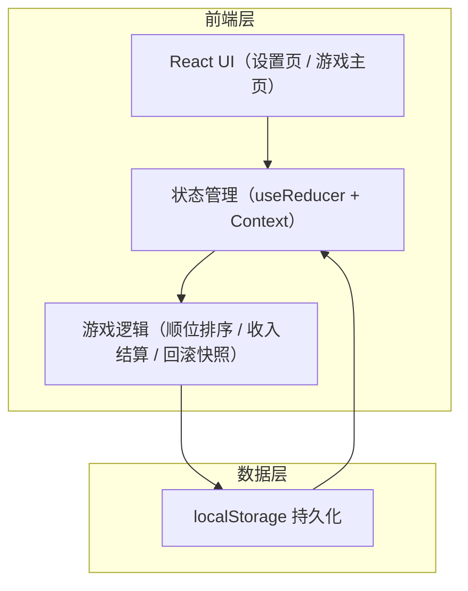

## 1. 架构设计



纯前端单页应用，无后端。游戏状态通过 useReducer 集中管理，每次「结束回合」生成快照入栈供「回滚」使用，并写入 localStorage 防刷新丢失。

## 2. 技术选型

- **前端**：React 18 + TailwindCSS 3 + Vite
- **状态管理**：React 内置 useReducer + Context（无需引入 Redux/Zustand，体量足够小）
- **持久化**：浏览器 localStorage
- **字体**：Google Fonts（Space Grotesk 用于数字、Inter 用于正文）
- **无后端、无数据库、无外部服务**

## 3. 路由定义

| 路由 | 用途 |
|-------|---------|
| `/` | 设置页：玩家数量、颜色、顺位、初始资金配置 |
| `/game` | 游戏主页：玩家卡片、花费/收入操作、结束/回滚 |

使用简单的条件渲染（`screen` state）切换页面，不引入 react-router 以保持极简。

## 4. 核心数据模型

### 4.1 玩家模型

```typescript
type PlayerColor = 'red' | 'yellow' | 'purple' | 'white';

interface Player {
  id: string;            // 唯一标识
  color: PlayerColor;    // 玩家颜色
  money: number;         // 当前剩余金钱
  spentThisRound: number;// 本回合已花费
  incomeLevel: number;   // 收入轨等级（0-100）
}

interface GameState {
  players: Player[];     // 玩家数组，数组顺序即当前顺位
  round: number;         // 当前回合数（从 1 开始）
  phase: 'setup' | 'playing'; // 当前阶段
  history: GameState[];  // 历史快照栈，用于回滚
}
```

### 4.2 游戏规则常量

```typescript
// 初始资金默认值
const INITIAL_MONEY: Record<number, number> = {
  2: 30,
  3: 20,
  4: 17,
};

// 玩家颜色配置
const PLAYER_COLORS: Record<PlayerColor, { bg: string; text: string; label: string }> = {
  red:    { bg: '#c83232', text: '#fff',    label: '红' },
  yellow: { bg: '#e0b020', text: '#1a1a1a', label: '黄' },
  purple: { bg: '#7b3fa0', text: '#fff',    label: '紫' },
  white:  { bg: '#e8e8e8', text: '#1a1a1a', label: '白' },
};
```

## 5. 核心算法

### 5.1 结束回合结算

```typescript
function endRound(state: GameState): GameState {
  // 1. 推入历史快照（深拷贝当前状态，spentThisRound 清零前的完整状态）
  const snapshot = deepClone(state);

  // 2. 按本回合花费升序排顺位（花费少者在前，同花费保持原顺序——稳定排序）
  const sortedPlayers = [...state.players].sort(
    (a, b) => a.spentThisRound - b.spentThisRound
  );

  // 3. 按收入等级发放收入到金钱，并清零本回合花费
  const newPlayers = sortedPlayers.map(p => ({
    ...p,
    money: p.money + p.incomeLevel,
    spentThisRound: 0,
  }));

  return {
    ...state,
    players: newPlayers,
    round: state.round + 1,
    history: [...state.history, snapshot],
  };
}
```

### 5.2 回滚上一回合

```typescript
function rollback(state: GameState): GameState {
  if (state.history.length === 0) return state;
  const previous = state.history[state.history.length - 1];
  return {
    ...previous,
    history: state.history.slice(0, -1),
  };
}
```

## 6. 状态持久化

- 每次 state 变更后写入 `localStorage.setItem('brass-helper', JSON.stringify(state))`
- 应用启动时读取并恢复；如无数据则进入设置页
- 提供「重新开始」按钮清空 localStorage 回到设置页
